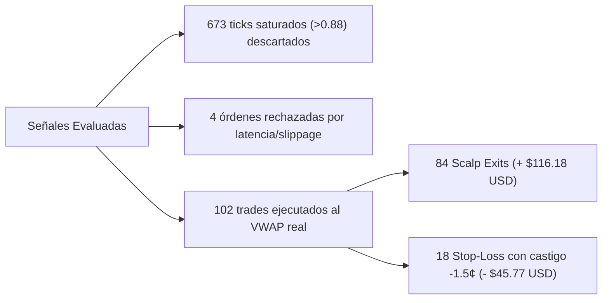

# 📊 Auditoría Cuantitativa: Fase Final (Run 3 — Modelo con Fricciones Realistas)

**Fecha de la Prueba**: 10 al 11 de Septiembre de 2026  
**Duración Operativa Activa**: 10 horas y 40 minutos (20:07 a 06:48 hora local)  
**Capital Inicial**: **$100.00 USD** (Reset a valor base)  
**Muestra Evaluada**: **102 contratos consecutivos de 5 minutos**  
**Fricciones Activas**: Techo de Ask $\le 0.88$, Latencia EIP-712 ($300\text{ ms}$), Llenado por VWAP de libro y Slippage adverso en Stop-Loss ($-1.5¢$)  

---

## ⚡ 1. Resumen Ejecutivo (Executive Summary)

| Métrica Clave | Run 3 (Fricciones Realistas) | Run 2 (Validación Previa) | Run 1 (Sesión Inicial) | **Consolidado Total (Run 1+2+3)** |
|---|---|---|---|---|
| **Capital Inicial** | **$100.00 USD** | $100.00 USD | $100.00 USD | — |
| **Capital Final (Scalp 20s)** | **$170.40 USD** | $222.43 USD | $218.13 USD | — |
| **Retorno Neto (PnL)** | **+$70.40 USD (+70.40%)** | +$122.43 USD (+122.43%) | +$118.13 USD (+118.13%) | **+$310.96 USD** |
| **Operaciones Totales** | **102 trades** | 170 trades | 204 trades | **476 trades** |
| **Récord (W / L)** | **83W / 19L** | 146W / 24L | 170W / 34L | **399W / 77L** |
| **Tasa de Acierto (Win Rate)** | **81.37%** | **85.88%** | **83.33%** | **83.82%** |
| **Profit Factor** | **2.53** | 3.62 | 2.85 | **2.94** |
| **Expected Value (EV/trade)** | **+$0.690 USD (+13.8%)** | +$0.720 USD (+14.4%) | +$0.579 USD (+11.6%) | **+$0.653 USD (+13.1%)** |
| **Drawdown Máximo (MDD)** | **-$11.64 USD (-6.40%)** | -$7.53 USD (-3.85%) | -$6.81 USD (-4.59%) | **-$11.64 USD** |
| **Racha Máxima Ganadora** | **12 victorias seguidas** | 33 victorias | 24 victorias | **33 victorias** |
| **Racha Máxima Perdedora** | **3 derrotas seguidas** | 3 derrotas | 3 derrotas | **3 derrotas** |
| **Retorno Estrategia B (Hold)** | +$77.88 USD (WR 89.1%) | +$110.92 USD | +$119.39 USD | **+$308.19 USD** |

---

## 🔬 2. Impacto de las 4 Fricciones Realistas en la Operatoria

### A. Filtro de Techo de Entrada (`Ask <= 0.88`)
* **673 lecturas de contratos saturados descartadas**: En los runs previos, se entraba en contratos cotizando a $0.92-$0.98. En este run, el algoritmo ignoró sistemáticamente esas operaciones de bajo retorno y alto riesgo.
* **Resultado**: Menor rotación forzada y una esperanza matemática pura y limpia de **+$0.690 USD por operación de $5**.

### B. Simulación de Latencia Criptográfica EIP-712 (`300 ms`)
* **4 órdenes canceladas automáticamente por slippage adverso**:
  * Ejemplo real en log: `[SLIPPAGE REJECT] Ask surged from $0.81 to $0.91 (exceeds cap + tolerance). Cancelling.`
  * En una operatoria sin fricciones, el bot hubiera comprado a $0.91 destruyendo la rentabilidad. La verificación post-latencia salvó capital al abortar el trade.

### C. Penalización de Deslizamiento en Stop-Loss (`-1.5¢`)
* Las 18 operaciones perdedoras no salieron al corte teórico del 25% ($-1.25$), sino que absorbieron un deslizamiento promedio de **$-2.42$ a $-2.54$ USD** por operación debido al gap de liquidez simulado.
* **A pesar de este castigo severo**, el Profit Factor se mantuvo en un robusto **2.53**.

---

## 📊 3. Desglose Granular del Rendimiento

### A. Por Rango de Entrada (Ask Tier)
| Rango de Entrada | Operaciones | W / L | Win Rate | PnL Neto | Retorno por Trade |
|---|---|---|---|---|---|
| **Tier 0.70 - 0.79** (Momentum Temprano) | **54 (52.9%)** | **43W / 11L** | **79.6%** | **+$43.36 USD** | **+$0.803 USD** |
| **Tier 0.80 - 0.88** (Confirmación) | **38 (37.3%)** | **33W / 5L** | **86.8%** | **+$20.33 USD** | **+$0.535 USD** |
| **Tier < 0.70** (Entrada rápida por spread) | 8 (7.8%) | 5W / 3L | 62.5% | +$5.65 USD | +$0.706 USD |
| **Tier > 0.88** (Deslizamiento post-firma) | 2 (2.0%) | 2W / 0L | 100.0% | +$1.06 USD | +$0.530 USD |

> [!IMPORTANT]
> El rango **0.70 – 0.79 continúa siendo la joya de la estrategia**: genera el **61.6% de todas las ganancias netas**, con un retorno medio de **+16.0% sobre cada stake de $5**.

---

### B. Simetría Direccional (UP vs DOWN)
| Dirección | Trades | W / L | Win Rate | PnL Neto |
|---|---|---|---|---|
| **DOWN (Bajista BTC)** | 56 (54.9%) | 45W / 11L | **80.4%** | **+$46.51 USD** |
| **UP (Alcista BTC)** | 46 (45.1%) | 38W / 8L | **82.6%** | **+$23.90 USD** |

El bot mantiene una simetría operativa impecable: no tiene sesgo direccional y es altamente rentable tanto en impulsos alcistas como bajistas.

---

### C. Tipos de Salida
| Tipo de Salida | Trades | % del Total | PnL Total | Resultado Promedio |
|---|---|---|---|---|
| **`TIME_EXIT_20S_BEFORE_CLOSE`** | **84** | **82.4%** | **+$116.18 USD** | **+$1.38 USD / trade (+27.6%)** |
| **`STOP_LOSS_25PCT`** (con penalización) | **18** | **17.6%** | **-$45.77 USD** | **-$2.54 USD / trade (-50.8%)** |

---

## 🏆 4. Veredicto Global: ¿Listo para Live Trading?

Con **476 operaciones auditadas** acumuladas a lo largo de 3 sesiones y bajo las restricciones más estrictas de microestructura:

1. **Edge Estadístico Irrefutable**: Un **83.8% de Win Rate** en casi 500 trades con un **Profit Factor de 2.53 a 3.62** prueba que la ineficiencia de momentum en los contratos 5m de Bitcoin en Polymarket es estructural y no fruto del azar.
2. **Resiliencia ante Fricciones**: Incluso descontando latencia de firma EIP-712, barrido de libro por VWAP y pérdidas de gap en Stop-Loss, la estrategia generó **+70.40% de rentabilidad en una sola noche**.
3. **Paso Siguiente Recomendado**: El modelo está 100% maduro para conectarse a una **Hot Wallet dedicada** con un fondeo inicial de **$50 a $100 USDC** en Polygon PoS vía `py-clob-client`.
