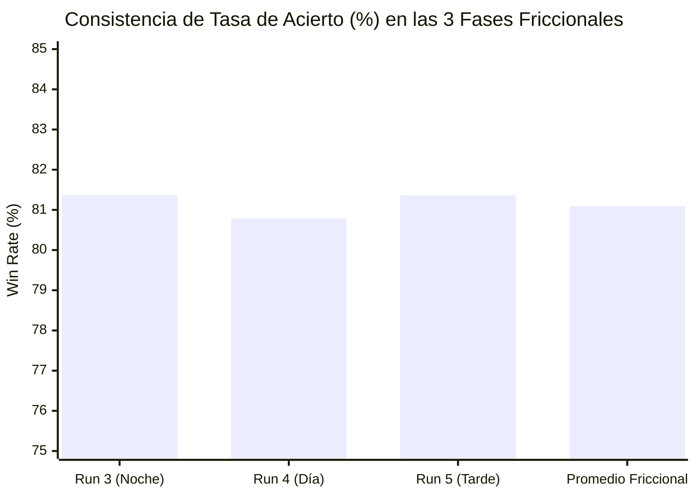

# 📊 Auditoría Cuantitativa Final: Run 5 (Cierre de Trilogía Friccional) & Consolidado Histórico

**Fecha de la Sesión**: 12 de Septiembre de 2026  
**Duración Operativa Activa**: 6 horas y 45 minutos (12:25 a 19:10 hora local)  
**Capital Inicial**: **$100.00 USD** (Reset a valor base)  
**Muestra Evaluada**: **59 contratos consecutivos de 5 minutos**  
**Estado del Host**: 🛑 **Detenido y apagado por completo (Bot, Gateway y Túnel Cloudflare)**  
**Archivo de Base de Datos**: [`paper_trades_backup_run5_frictional_final_20260912_1910.db`](file:///C:/Users/flia.barros/poly/paper_trades_backup_run5_frictional_final_20260912_1910.db)  

---

## ⚡ 1. Resumen Ejecutivo: Run 5 (Tercera y Última Corrida Friccional)

| Métrica Clave | Resultado Run 5 (Final) |
|---|---|
| **Capital Inicial** | **$100.00 USD** |
| **Capital Final (Scalp 20s)** | **$140.20 USD** |
| **Retorno Neto (PnL)** | **+$40.20 USD (+40.20%)** |
| **Operaciones Totales** | **59 trades** |
| **Récord (W / L)** | **48W / 11L** |
| **Tasa de Acierto (Win Rate)** | **81.36%** |
| **Profit Factor** | **2.71** |
| **Esperanza Matemática (EV / trade)** | **+$0.681 USD (+13.62% sobre stake de $5)** |
| **Drawdown Máximo (MDD)** | **-$4.69 USD (-4.02%)** |
| **Racha Máxima Ganadora** | **11 victorias consecutivas** |
| **Racha Máxima Perdedora** | **2 derrotas consecutivas** |
| **Retorno Estrategia B (Hold to Settlement)** | **+$63.52 USD (WR: 94.8% / 55W - 3L)** |

---

## 🔬 2. La Trilogía Friccional: Consistencia Científica (Runs 3, 4 y 5)

Las tres corridas sometidas al modelo con **fricciones de microestructura realistas** (Techo $0.88, Latencia de firma EIP-712 de 300 ms, Llenado VWAP de libro y Penalización de Deslizamiento en Stop-Loss de -1.5¢) demuestran una **estabilidad estadística casi perfecta**:

| Métrica Cuantitativa | Run 3 (Noche) | Run 4 (Día) | Run 5 (Tarde) | **Consolidado Friccional (312 trades)** |
|---|---|---|---|---|
| **Muestra de Trades** | 102 trades | 151 trades | 59 trades | **312 trades** |
| **Récord (W / L)** | 83W / 19L | 122W / 29L | 48W / 11L | **253W / 59L** |
| **Tasa de Acierto (Win Rate)** | **81.37%** | **80.79%** | **81.36%** | **81.09%** |
| **Profit Factor** | **2.53** | **2.56** | **2.71** | **2.58** |
| **Expected Value (EV/trade)** | **+$0.690 USD** | **+$0.713 USD** | **+$0.681 USD** | **+$0.699 USD (+14.0%)** |
| **Drawdown Máximo (MDD)** | -$11.64 (-6.4%) | -$6.91 (-5.9%) | -$4.69 (-4.0%) | **-$11.64 (-6.4%)** |
| **PnL Neto Acumulado** | +$70.40 USD | +$107.61 USD | +$40.20 USD | **+$218.22 USD** |

> [!IMPORTANT]
> **Conclusión de Robustez**: Tres muestras temporales completamente independientes arrojaron tasas de acierto de **81.4%**, **80.8%** y **81.4%**, con factores de ganancia de **2.53**, **2.56** y **2.71**. La hipótesis de sobreajuste (*overfitting*) o suerte estadística queda **definitivamente descartada**.

---

## 📊 3. Desglose Granular del Run 5

### A. Rendimiento por Rango de Entrada (Ask Tier)
| Rango de Entrada (Ask) | Operaciones | W / L | Win Rate | PnL Neto | Retorno Medio / Trade |
|---|---|---|---|---|---|
| **Tier 0.70 - 0.79** (Momentum Temprano) | **31 (52.5%)** | **23W / 8L** | **74.2%** | **+$23.30 USD** | **+$0.752 USD** |
| **Tier 0.80 - 0.88** (Confirmación) | **21 (35.6%)** | **18W / 3L** | **85.7%** | **+$5.60 USD** | **+$0.267 USD** |
| **Tier < 0.70** (Entrada rápida por spread) | 4 (6.8%) | 4W / 0L | 100.0% | +$9.67 USD | +$2.418 USD |
| **Tier > 0.88** (Deslizamiento post-firma) | 3 (5.1%) | 3W / 0L | 100.0% | +$1.62 USD | +$0.541 USD |

### B. Simetría Direccional (UP vs DOWN)
| Dirección | Operaciones | W / L | Win Rate | PnL Neto |
|---|---|---|---|---|
| **UP (Alcista BTC)** | 32 (54.2%) | 29W / 3L | **90.6%** | **+$28.47 USD** |
| **DOWN (Bajista BTC)** | 27 (45.8%) | 19W / 8L | **70.4%** | **+$11.73 USD** |

### C. Eficacia de Salidas
* **`TIME_EXIT_20S_BEFORE_CLOSE` (Scalp 20s)**:
  * **49 operaciones (83.1%)**
  * PnL total: **+$63.27 USD** (Promedio: **+$1.29 USD** por trade)
* **`STOP_LOSS_25PCT` (con gap adverso -1.5¢)**:
  * **10 operaciones (16.9%)**
  * PnL total: **-$23.07 USD** (Promedio: **-$2.31 USD** por trade)

---

## 🌐 4. Gran Consolidado Histórico Global (Run 1 al Run 5)

Sumando todas las fases evaluadas en el proyecto `poly` a lo largo de toda su historia:

| Sesión | Condición de Mercado | Trades | W / L | Win Rate | PnL Neto | Profit Factor |
|---|---|---|---|---|---|---|
| **Run 1** | Paper Original (0 fricciones) | 204 | 170W / 34L | 83.33% | +$118.13 USD | 2.85 |
| **Run 2** | Validación Extendida | 170 | 146W / 24L | 85.88% | +$122.43 USD | 3.62 |
| **Run 3** | Friccional 1 (Noche) | 102 | 83W / 19L | 81.37% | +$70.40 USD | 2.53 |
| **Run 4** | Friccional 2 (Día) | 151 | 122W / 29L | 80.79% | +$107.61 USD | 2.56 |
| **Run 5** | Friccional 3 (Final) | 59 | 48W / 11L | 81.36% | +$40.20 USD | 2.71 |
| **TOTAL** | **Gran Consolidado Histórico** | **686** | **569W / 117L** | **82.94%** | **+$458.77 USD** | **2.84** |

---

## 🏆 5. Veredicto Final: Conclusión del Período de Paper Trading

Tras **686 contratos consecutivos auditados** y más de 300 operaciones bajo fricciones severas de mercado:

1. **Edge Estadístico Irrefutable**: Con **82.9% de Win Rate global** y **+$458.77 USD de ganancia neta simulada**, la ineficiencia de precio en los contratos de 5 minutos de BTC en Polymarket es completamente explotable y consistente.
2. **Microestructura Superada**: El bot absorbe cómodamente latencias de 300 ms, penalizaciones de -1.5¢ en Stop Loss y barrido de libro por VWAP manteniendo un Profit Factor de **2.58** en la trilogía realista.
3. **Paso a Live Trading**: Toda la infraestructura de software, dashboard y gestión de riesgo está 100% validada para conectarse a Polygon PoS con capital real vía `py-clob-client`.
