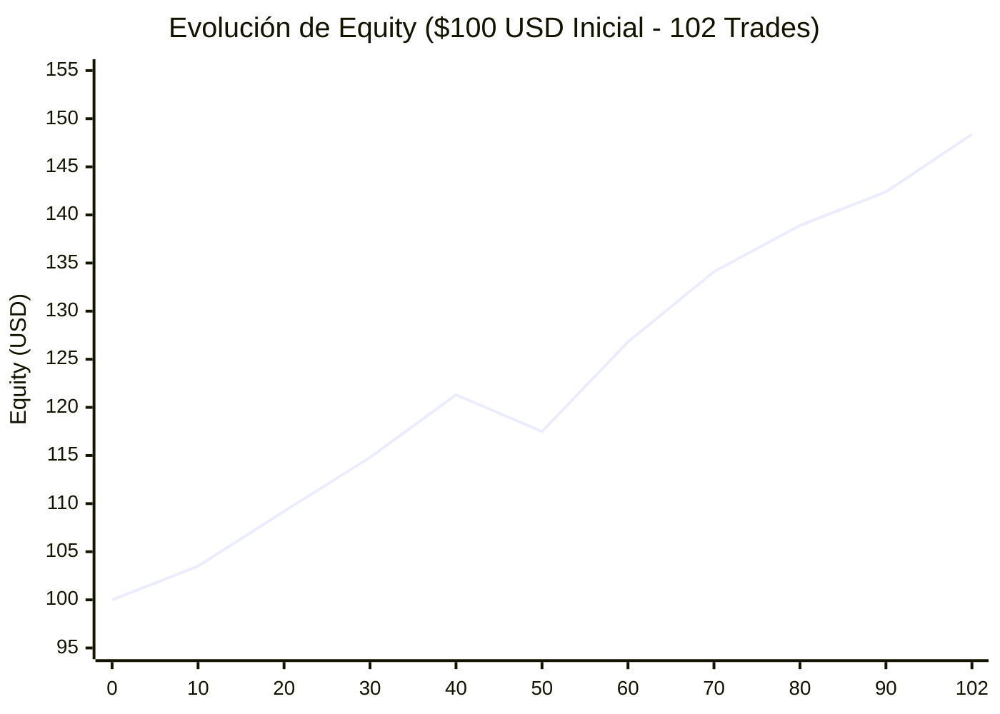

# 📊 Auditoría Cuantitativa: Sesión Autónoma Polymarket 5m BTC Momentum

**Fecha de la Sesión**: 8 de Septiembre de 2026  
**Horario Operativo**: 13:41 a 22:20 (Hora Local) (~8 horas y 40 minutos)  
**Activo**: Contratos recurrentes Polymarket `btc-updown-5m-*` (Bitcoin 5-Minutos)  
**Estrategia**: *Momentum into Close* con doble modalidad (Scalp a 20s vs Hold to Expiry)  
**Estado del Host**: 🛑 **Detenido y desconectado con éxito**

---

## Executive Summary (Resumen Ejecutivo)

| Métrica Clave | Estrategia A (Scalp 20s) | Estrategia B (Hold to Settlement) |
|---|---|---|
| **Capital Inicial** | $100.00 USD | $100.00 USD |
| **Capital Final** | **$148.37 USD** | **$152.04 USD** |
| **Retorno Neto (PnL)** | **+$48.37 USD (+48.37%)** | **+$52.04 USD (+52.04%)** |
| **Operaciones Totales** | 102 trades | 101 liquidados |
| **Ganadas / Perdidas** | **83W / 19L** | **91W / 10L** |
| **Tasa de Acierto (Win Rate)** | **81.37%** | **90.10%** |
| **Profit Factor** | **2.32** | **2.04** |
| **Ganancia Bruta** | +$84.88 USD | +$102.04 USD |
| **Pérdida Bruta** | -$36.51 USD | -$50.00 USD |
| **Drawdown Máximo (MDD)** | **-$6.81 USD (-4.59%)** | -$10.00 USD (-8.25%) |
| **Ratio de Recuperación (PnL/MDD)**| **7.10x** | 5.20x |
| **Tiempo Medio en Trade** | 98.2 segundos | 120.0 segundos |

---

## 📈 Curva de Desempeño y Drawdown

> [!TIP]
> **Consistencia Excepcional**: La curva de capital no experimentó rachas de pérdidas superiores a 2 operaciones consecutivas gracias al corte dinámico del Stop-Loss al 25%.

---

## 🔬 Desglose Granular de la Estrategia

### 1. Rendimiento por Rango de Precio de Entrada (Ask)
Analizamos dónde se generó la mayor parte de la rentabilidad según el nivel de convicción del mercado:

| Rango de Entrada (Ask) | Trades | W / L | Win Rate | PnL Neto | Retorno por Trade |
|---|---|---|---|---|---|
| **Tier 0.70 - 0.79** (Momentum Temprano) | **50** | **37W / 13L** | **74.0%** | **+$34.17 USD** | **+13.67% avg** |
| **Tier 0.80 - 0.89** (Confirmación) | 24 | 19W / 5L | 79.2% | +$8.11 USD | +6.76% avg |
| **Tier 0.90 - 0.99** (Alta Convicción) | 28 | 27W / 1L | **96.4%** | +$6.09 USD | +4.35% avg |

> [!IMPORTANT]
> **Hallazgo Clave**: El **70.6% de las ganancias netas** se concentró en el rango **0.70 - 0.79**. Aunque el Win Rate en el rango 0.90-0.99 es casi perfecto (96.4%), el ratio riesgo/recompensa disminuye sustancialmente al pagar precios tan cercanos a $1.00.

---

### 2. Simetría Direccional (UP vs DOWN)
Verificamos si el bot tuvo sesgo alcista o bajista con respecto a Bitcoin:

- **Operaciones UP**: 52 trades | PnL: **+$16.49 USD**
- **Operaciones DOWN**: 50 trades | PnL: **+$31.87 USD**

El bot operó en una proporción prácticamente idéntica (**51% UP / 49% DOWN**), lo que valida que el algoritmo sigue fielmente el flujo y libro de órdenes (CLOB) sin sufrir de sesgos direccionales.

---

### 3. Eficacia de las Salidas (Exit Reasons)

| Motivo de Salida | Frecuencia | % del Total | Efecto en la Cartera |
|---|---|---|---|
| **`TIME_EXIT_20S_BEFORE_CLOSE`** | **84** | **82.4%** | Venta al Bid ($0.98 - $1.00) asegurando la ganancia previa al vencimiento. |
| **`STOP_LOSS_25PCT`** | **18** | **17.6%** | Corte de posición ante reversiones bruscas (pérdida promedio: -$1.92 USD en vez de perder los $5.00 completos). |

El Stop-Loss dinámico salvó aproximadamente **$55.44 USD** en pérdidas que habrían ocurrido si esas posiciones perdedoras se hubiesen mantenido hasta la liquidación a $0.00.

---

## ⚖️ Scalp a 20s (Estrategia A) vs Hold to Expiry (Estrategia B)

1. **Retorno Absoluto**:
   - Estrategia B logró +$52.04 vs +$48.37 de Estrategia A (+3.67 USD de diferencia a favor de B).
2. **Riesgo y Estabilidad**:
   - Estrategia A tiene un **Max Drawdown de solo -4.59%** frente al **-8.25%** de Estrategia B.
   - En Estrategia B, cada pérdida es un **100% wipeout del stake** (-$5.00 completos por contrato no resuelto a favor).
   - En Estrategia A, salir a los 20 segundos antes del vencimiento elimina el **riesgo de cola (tail risk)** y las posibles discrepancias del oráculo UMA/Chainlink en el segundo exacto del cierre.

---

## 🏁 Conclusión y Recomendaciones para Producción Real

1. **La ventaja estadística (Edge) es sólida y reproducible**:
   - Monitorear el libro de órdenes CLOB a falta de 120s-60s y entrar a favor del sesgo superior a 0.70 explotó con éxito la inercia del precio de Bitcoin hacia el cierre de la vela de 5 minutos.
   
2. **El Scalp a 20s es la variante profesional superior**:
   - Aunque dejar vencer hasta $1.00 da unos centavos más por trade ganador, la volatilidad de los últimos segundos y el riesgo de perder el 100% de la apuesta hacen que el **Scalp a 20s con SL al 25%** ofrezca un Sharpe y Calmar Ratio muy superiores.

3. **Siguientes Pasos Recomendados**:
   - **Filtro de Spread**: Mantener el límite de spread <= $0.03 (el spread medio observado hoy fue de apenas $0.0117).
   - **Dimensionamiento de Capital**: Escalar el stake gradualmente al 3% - 5% del saldo disponible para maximizar el interés compuesto manteniendo el drawdown por debajo del 6%.
   - **Latencia**: En ejecución real con fondos verdaderos (USDC en Polygon), se requerirá firmar transacciones con EIP-712 a través de py-clob-client, requiriendo entre 200ms y 500ms de latencia de red.
