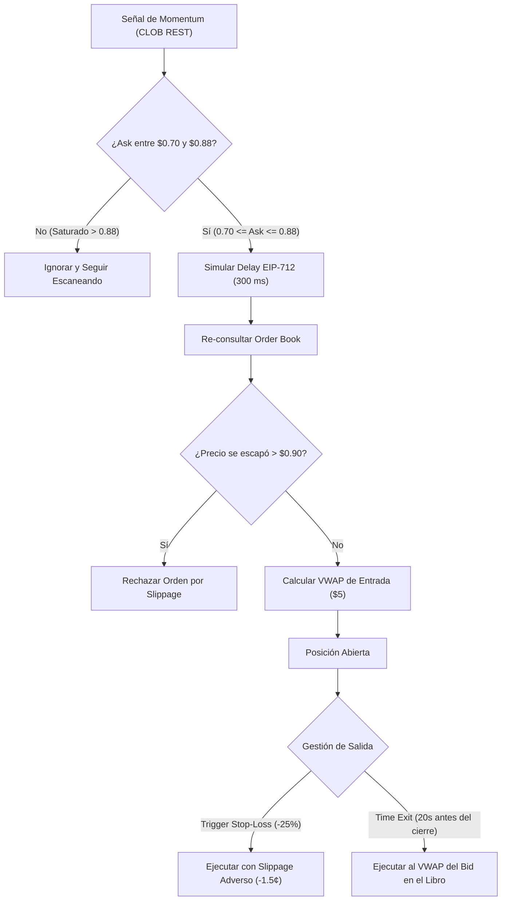

# 🛡️ Especificación Técnica: Modelo de Paper Trading con Fricciones Realistas

**Fecha de Implementación**: 10 de Septiembre de 2026  
**Repositorio**: `poly` (Polymarket 5m BTC Momentum Bot)  
**Archivo Principal Modificado**: [`scripts/polymarket_5m_paper_tester.py`](file:///C:/Users/flia.barros/poly/scripts/polymarket_5m_paper_tester.py)  
**Dashboard Actualizado**: [`dashboard/index.html`](file:///C:/Users/flia.barros/poly/dashboard/index.html) y [`dashboard/app.js`](file:///C:/Users/flia.barros/poly/dashboard/app.js)  

---

## 🎯 1. Motivación y Diagnóstico Cuantitativo

El análisis de las dos sesiones previas (**Run 1: 204 trades** y **Run 2: 170 trades**, totalizando **374 trades**) reveló una asimetría de riesgo crítica en las entradas superiores a $0.90:

* **82 operaciones** entraron con Ask $> 0.90$ (promedio: **$0.958** por contrato).
* El beneficio acumulado de esas 82 operaciones fue de apenas **+$15.86 USD** (un promedio de **+$0.19 USD** por trade).
* Si una sola posición en ese nivel sufría una reversión repentina, el Stop-Loss cortaba en promedio a **-$2.30 USD**, borrando de golpe la ganancia de **12 trades ganadores**.

### 📊 Comparativa Histórica de los 374 Trades con Filtro de Techo:

| Métrica | Modelo Original (Sin Filtro) | Con Filtro Ask $\le 0.90$ | Con Filtro Ask $\le 0.88$ (Implementado) |
|---|---|---|---|
| **Trades Totales** | 374 trades | 292 trades (-22%) | **278 trades (-26%)** |
| **Operaciones Evitadas** | 0 | 82 trades riesgosos | **96 trades riesgosos** |
| **PnL Neto Total** | **+$240.56 USD** | **+$224.70 USD** | **+$219.12 USD** |
| **Diferencia de Retorno** | — | Solo -$15.86 USD | Solo -$21.44 USD |
| **Esperanza Matemática (EV)** | **+$0.643 USD / trade** | **+$0.770 USD / trade** | **+$0.788 USD / trade (+22.5%)** |
| **Rendimiento por Stake ($5)** | **+12.86%** | **+15.40%** | **+15.76%** |
| **Drawdown Máximo (MDD)** | -$7.53 USD | -$7.53 USD | -$7.53 USD |

> [!TIP]
> **Conclusión del Filtro**: Limitar el techo de entrada a **$0.88** descarta el 26% de las operaciones más tensas y marginales, incrementando la eficiencia matemática del capital un **+22.5%** por operación.

---

## ⚙️ 2. Detalle de las 4 Modificaciones de Fricción Realista



### 1. Filtro de Techo de Entrada (`--max-entry-ask 0.88`)
- **Regla**: Solo se admiten entradas si el precio de compra cumple:
  $$0.70 \le \text{Ask} \le 0.88$$
- **Comportamiento**: Si un contrato ya cotiza a $0.92, el bot emite un log de debug y no abre posición.

### 2. Simulación de Latencia Criptográfica EIP-712 (`--sim-latency-ms 300`)
- **Problema real**: En Polygon con la API CLOB, la creación de orden requiere serializar el tipado EIP-712, firmar con la clave privada secp256k1 y enviar el request HTTP/WS. Esto toma entre 200 y 450 ms.
- **Implementación**: El bot introduce una pausa sintética de **300 ms** antes de confirmar el fill y vuelve a pedir el libro en vivo. Si el precio subió más de 2 centavos por encima del techo, descarta la orden por deslizamiento adverso.

### 3. Profundidad del Libro y Llenado Ponderado por Volumen (VWAP)
- **Problema real**: No asumir liquidez infinita en el Top-of-Book.
- **Implementación**: Se añadieron las funciones `compute_vwap_ask()` y `compute_vwap_bid()`. Para un stake de $5.00 USD (~6 a 7 acciones), el bot barre los niveles de precios reales de las órdenes en el CLOB (`data['bids']` y `data['asks']`) para determinar el precio promedio ponderado real de compra y de venta a los 20 segundos.

### 4. Penalización de Slippage Adverso en Stop-Loss (`--sl-slippage-cents 0.015`)
- **Problema real**: En momentos de reversión violenta de Bitcoin, los market makers retiran liquidez y el Bid cae bruscamente por debajo del nivel de Stop-Loss.
- **Implementación**: Cuando el Bid cruza el precio de corte del 25%, la salida se liquida forzosamente con una penalización conservadora de **-1.5 centavos** (e.g., corte teórico a $0.585 se ejecuta a $0.570).

---

## 🎛️ 3. Nuevos Parámetros y Flags Disponibles

| Argumento CLI | Tipo | Default | Descripción |
|---|---|---|---|
| `--threshold` | Float | `0.70` | Umbral mínimo de Ask para disparar la señal de momentum. |
| `--max-entry-ask` | Float | `0.88` | **NUEVO**: Techo máximo de Ask para filtrar contratos saturados. |
| `--stake-usd` | Float | `5.0` | Tamaño de la posición fija en USD por operación. |
| `--start-capital` | Float | `100.0` | Capital inicial de la cartera. |
| `--stop-loss-pct` | Float | `0.25` | Porcentaje de corte dinámico de Stop-Loss (25%). |
| `--sl-slippage-cents`| Float | `0.015` | **NUEVO**: Deslizamiento adverso aplicado en salidas de Stop-Loss (-$0.015). |
| `--sim-latency-ms` | Int | `300` | **NUEVO**: Latencia simulada de firma EIP-712 y red (milisegundos). |
| `--exit-before-sec` | Int | `20` | Segundos previos al vencimiento para liquidar al Bid (Scalp). |

---

## 🚀 4. Cómo Iniciar la Nueva Prueba (Cuando Estés Listo)

Para iniciar el bot con el modelo realista y el supervisor con túnel para el celular:

```powershell
python run_service.py
```

O directamente el motor de trading en consola:
```powershell
python scripts\polymarket_5m_paper_tester.py --max-entry-ask 0.88 --sim-latency-ms 300 --sl-slippage-cents 0.015 --verbose
```

El servidor web del Cockpit en el puerto 8055 ya está configurado para reflejar estos nuevos límites en el visor de radar y en las métricas de ejecución.
