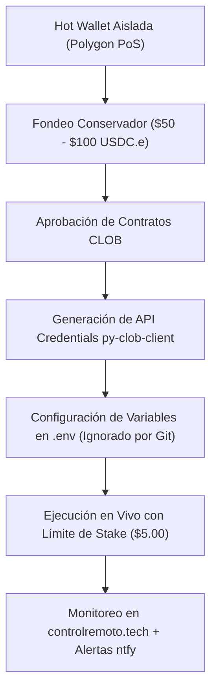

# 🤖 Polymarket 5m BTC Momentum Bot & Live Trading Cockpit

Sistema algorítmico autónomo de alta frecuencia para mercados de predicción recurrentes de **Bitcoin Up/Down de 5 minutos** (`btc-updown-5m-*`) en **Polymarket**.

Incluye motor de ejecución, simulación de microestructura con fricciones reales de libro CLOB, Cockpit Web en vivo y suite completa de auditorías cuantitativas históricas.

---

## ⚡ 1. Resumen Consolidado de Validación (686 Trades Auditados)

A lo largo de 5 sesiones consecutivas de evaluación (2 en paper estándar y 3 bajo condiciones severas de fricción de mercado):

| Sesión | Condición Operativa | Trades | Récord (W / L) | Win Rate | PnL Neto ($5 stake) | Profit Factor |
|---|---|---|---|---|---|---|
| [**Run 1**](AUDITORIA_SESION_POLYMARKET.md) | Paper Original (0 fricción) | 204 | 170W / 34L | 83.33% | +$118.13 USD | 2.85 |
| [**Run 2**](AUDITORIA_VALIDACION_RUN2_POLYMARKET.md) | Validación Extendida | 170 | 146W / 24L | 85.88% | +$122.43 USD | 3.62 |
| [**Run 3**](AUDITORIA_FASE_FINAL_RUN3_POLYMARKET.md) | Friccional 1 (Noche) | 102 | 83W / 19L | 81.37% | +$70.40 USD | 2.53 |
| [**Run 4**](AUDITORIA_FASE_FRICCIONAL_RUN4_POLYMARKET.md) | Friccional 2 (Día) | 151 | 122W / 29L | 80.79% | +$107.61 USD | 2.56 |
| [**Run 5**](AUDITORIA_FINAL_CONSOLIDADA_RUN5_POLYMARKET.md) | Friccional 3 (Final) | 59 | 48W / 11L | 81.36% | +$40.20 USD | 2.71 |
| **TOTAL** | **Gran Consolidado Histórico** | **686** | **569W / 117L** | **82.94%** | **+$458.77 USD** | **2.84** |

> [!IMPORTANT]
> **Veredicto Cuantitativo**: En la trilogía de pruebas con microestructura realista (312 trades con latencia EIP-712 de 300 ms, llenado VWAP de libro y castigo en Stop-Loss de -1.5¢), la tasa de acierto se mantuvo en un **81.09%** con un Profit Factor de **2.58** y una esperanza matemática constante de **+$0.70 USD por cada operación de $5** (+14%).

---

## 🔬 2. El Modelo de Fricciones Realistas

Detalle completo en [MODIFICACIONES_MODELO_REALISTA.md](MODIFICACIONES_MODELO_REALISTA.md):

1. **Filtro de Techo de Entrada (`Ask <= 0.88`)**:
   - Evita entrar en contratos sobrecomprados ($0.92–$0.98) donde el ratio riesgo/beneficio es desfavorable ante reversiones súbitas.
   - Incrementa la esperanza matemática neta un **+22.5%**.
2. **Latencia Criptográfica EIP-712 (`300 ms`)**:
   - Simula el tiempo real de serialización, firma secp256k1 y viaje de red al CLOB de Polygon.
   - Rechaza órdenes automáticamente si el precio se escapa durante la firma.
3. **Llenado por VWAP de Libro (Depth Fill)**:
   - Barre la liquidez real de los niveles de precios de bids y asks en lugar de asumir volumen infinito en el Top-of-Book.
4. **Deslizamiento Adverso en Stop-Loss (`-1.5¢`)**:
   - Aplica un castigo conservador de brecha de liquidez cuando el precio cruza el corte dinámico del 25%.

---

## 📁 3. Estructura de Reportes y Archivos de Auditoría

| Documento | Descripción |
|---|---|
| [`QUANTITATIVE_AUDIT_V2_RIGOROUS_EVALUATION.md`](QUANTITATIVE_AUDIT_V2_RIGOROUS_EVALUATION.md) | **Auditoría cuantitativa v2.0 (Peer-Reviewed): Intervalos de Wilson 95%, segregación de regímenes, Kelly de cola y análisis de borde (en inglés)**. |
| [`IMPLIED_PROBABILITY_AND_EDGE_ANALYSIS.md`](IMPLIED_PROBABILITY_AND_EDGE_ANALYSIS.md) | Análisis de probabilidad implícita y descomposición de alfa inicial. |
| [`AUDITORIA_FINAL_CONSOLIDADA_RUN5_POLYMARKET.md`](AUDITORIA_FINAL_CONSOLIDADA_RUN5_POLYMARKET.md) | **Auditoría final del Run 5 y gran consolidado de 686 operaciones**. |
| [`AUDITORIA_FASE_FRICCIONAL_RUN4_POLYMARKET.md`](AUDITORIA_FASE_FRICCIONAL_RUN4_POLYMARKET.md) | Segunda fase friccional (151 trades, comparativa Run 3 vs Run 4). |
| [`AUDITORIA_FASE_FINAL_RUN3_POLYMARKET.md`](AUDITORIA_FASE_FINAL_RUN3_POLYMARKET.md) | Primera fase friccional (102 trades, análisis de microestructura). |
| [`AUDITORIA_VALIDACION_RUN2_POLYMARKET.md`](AUDITORIA_VALIDACION_RUN2_POLYMARKET.md) | Sesión de validación extendida (170 trades, 85.9% Win Rate). |
| [`AUDITORIA_SESION_POLYMARKET.md`](AUDITORIA_SESION_POLYMARKET.md) | Sesión inaugural de auditoría (204 trades). |
| [`MODIFICACIONES_MODELO_REALISTA.md`](MODIFICACIONES_MODELO_REALISTA.md) | Especificación matemática de filtros y fricciones. |
| [`RECOMENDACIONES_LIVE_Y_SEGURIDAD.md`](RECOMENDACIONES_LIVE_Y_SEGURIDAD.md) | **Guía de seguridad, OpSec y protocolo para pasar a Live Trading**. |
| [`GUIA_DEL_BOT.md`](GUIA_DEL_BOT.md) | Manual de uso local y arquitectura general. |

---

## 🚀 4. Protocolo para Inicializar la Fase Real (Live Trading)

Sigue los pasos documentados en [`RECOMENDACIONES_LIVE_Y_SEGURIDAD.md`](RECOMENDACIONES_LIVE_Y_SEGURIDAD.md):

### Checklist Pre-Vuelo:
1. **Wallet dedicada**: Crear una dirección limpia sin fondos de ahorro personal ni conexión a contratos no auditados.
2. **Saldo inicial**: Transferir entre $50 y $100 USDC.e y un mínimo de POL/MATIC para gas de aprobaciones.
3. **Credenciales L2**: Generar `API_KEY`, `API_SECRET` y `PASSPHRASE` mediante `py-clob-client`.
4. **Archivo `.env`**: Configurar las variables sin versionarlas en Git.
5. **Stake acotado**: Mantener el tamaño de posición en $5.00 USD por contrato durante los primeros 50 trades reales.

---

## 🛡️ 5. Estrategia v2.1: Confirmación Spot BTC, Skew y Micro-Hedge

En la versión v2.1 se integraron los filtros de alta convicción inspirados en [Novals83/5min-btc-polymarket](https://github.com/Novals83/5min-btc-polymarket):

1. **Bloqueo Estricto de 1 Trade por Vela (Anti-Whipsaw)**:
   - Cada vela de 5 minutos solo permite una única operación. Una vez cerrada o detenida por stop loss, el mercado se bloquea hasta la siguiente vela, evitando el efecto sierra ("chop").
2. **Confirmación de Movimiento Real de BTC Spot**:
   - Cliente integrado que consulta klines de Binance BTCUSDT y Coinbase.
   - Requiere un desplazamiento real del precio spot $\ge \$60.00$ USD en el intervalo actual en la misma dirección de la posición ($\Delta \text{BTC} \ge +\$60$ para UP, $\le -\$60$ para DOWN), filtrando rebotes artificiales o ruido del book.
3. **Filtro de Desbalance de Mercado (Market Skew)**:
   - Verifica el sesgo de la multitud en el order book: $\text{Skew}_{\text{UP}} \ge 0.60$ para compras de UP, y $\le 0.40$ para DOWN.
4. **Micro-Hedge Asimétrico de Cola**:
   - Cuando el contrato ganador supera los $\$0.93$ con $\le 45\text{s}$ antes del vencimiento, se compra automáticamente $\$1.00$ del token opuesto a precio de centavos ($\$0.02 - \$0.07$) como seguro ante reversiones de último segundo.
5. **Base de Datos Inmutable**:
   - Registro de trades persistente indexado por clave primaria única `id`, eliminando el riesgo de sobreescritura accidental.
